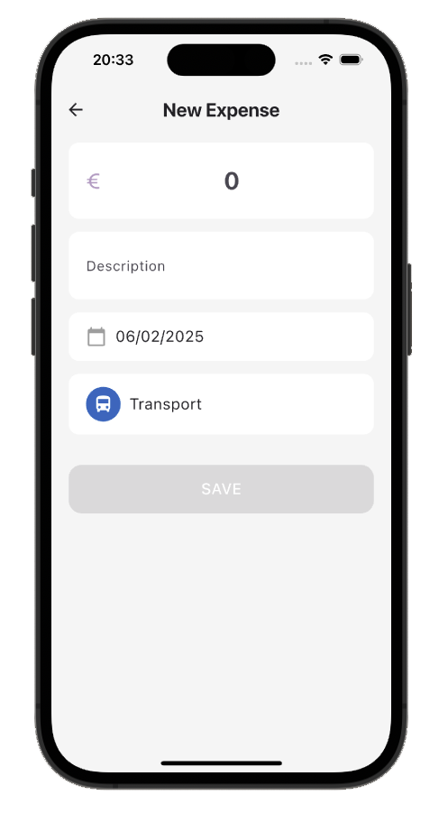
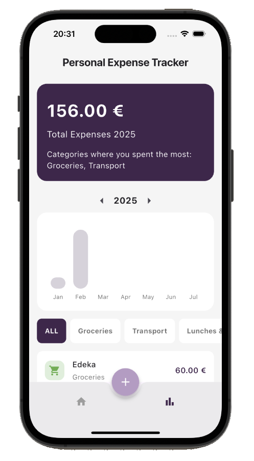

# Personal Expense Tracker App

## Overview
The Personal Expense Tracker App is a Flutter application designed to help users easily manage and track their expenses. 
Users can add new expenses, view them grouped by day, delete individual entries, and filter by categories (e.g., Food, Travel, Shopping). The app ensures that expense data is stored locally and remains available even after restarting the app. With a summary view showing total expenses for the month or year, the app also highlights the category with the highest spending.

Built using the BLoC pattern for state management, the app offers a clean separation of business logic from the UI, ensuring a scalable and maintainable codebase.

## Screenshots

  

  

  

  

## Features
* **Add Expense Entries**: Users can create new expense entries by clicking on the "+" button in the middle of the screen. This opens a dialog where the user can select a category for the expense. Each category is displayed with an associated icon for easy identification. After selecting a category, the user is presented with a new view where they can fill in the following fields:
    * **Amount**: The cost of the expense. This field is required and accepts both commas and dots as decimal separators but does not allow alphabetic characters. If the amount field is not filled, the save button will remain disabled.
    * **Description**: A short description of the expense. This field is required. If not filled, the save button will remain disabled.
    * **Date**: The date when the expense occurred. This field is optional and will default to the current date if not edited.

  The selected category will be automatically pre-filled and cannot be changed in this view. Once both the **Amount** and **Description** fields are filled correctly, the user can save the new expense.

* **Home Screen**: A list of expenses is displayed, grouped by day for better organization. Users can delete individual expense entries by swiping left on an expense item in the list or by clicking the delete button on each expense card. This action will remove the expense from the list and update the total expense calculation accordingly.

* **Statistics Screen** show:
    * Total expenses for the selected month or year. Users can filter the expences by clicking on the arrow (for year) or on the chart (for month).
    * The scrollable chart that show the expenses of the selected year divided per month.
    * The category/ies with the highest spending for the selected month or year.
    * **Category Filtering**: Users can filter expenses by category (e.g., Food, Travel, Shopping) and view the corresponding expenses.

* **Data Persistence**: Expenses are stored locally on the device using a persistence mechanism (e.g., SQLite or shared preferences), ensuring they remain visible even after restarting the app.

* **Responsive Design**: The app is optimized for different screen sizes and orientations.

## App Architecture Overview

The app follows a Clean Architecture pattern, which emphasizes a separation of concerns between the business logic and the presentation layers. 
The business logic is responsible for handling all application data, user interactions, and state management, while the presentation layer is focused purely on the UI, displaying data and responding to user inputs. 
This division allows for better maintainability, scalability, and testability.

This architecture is implemented using the BLoC (Business Logic Component) pattern for state management, along with a model-view approach where the app is divided into:

1. Business Logic Layer (BLoC)
2. Data Layer (Models and Repositories)
3. Presentation Layer (Screens and Widgets)

### 1. Business Logic Layer (BLoC)
The **business logic layer** of the app is responsible for handling the flow of data and events in the application. 
It ensures that the logic and state of the application are managed efficiently and can be easily tested. 
This layer is implemented using the BLoC (Business Logic Component) pattern, which uses streams and events to manage state.

**Components:**
* `navigation_bloc.dart`: This BLoC manages the navigation state of the app. It controls which screen is active and can be used to switch between different views (e.g., between the Home Screen and the Statistics Screen).
* `expenses_list_bloc.dart`: This BLoC is responsible for managing the list of expenses. It handles loading, adding, and deleting expenses from the database. The BLoC listens for events like LoadExpense, AddExpense, and DeleteExpense, and updates the state with the current list of expenses. It also performs data transformations, such as grouping expenses by date and calculating the total monthly expenditure.
* `expenses_stat_bloc.dart`: This BLoC is in charge of handling statistics related to expenses. It manages filtering expenses by category, year, and month. The BLoC listens for events like ChangeCategoryEvent, ChangeYearEvent, and ChangeMonthSelectionEvent to update the selected category, year, and month, and calculates filtered totals. Additionally, it provides insights like the highest spending category and monthly data for the selected year.
* `expense_form_bloc.dart`: This BLoC handles the state and validation of the expense form. It listens for changes in description, cost, and date fields. When the form is submitted, it validates the inputs and creates a new expense object, which is then added to the list of expenses. The BLoC also handles form resets and emits the corresponding state changes based on the user input.
* **State Management**: The app’s state is represented as states (e.g., expense list, navigation state, etc.) and events (e.g., add expense, update expense). The BLoC listens for these events and processes them, emitting new states as necessary.

### 2. Data Layer (Models and Repositories)
The **data layer** manages all of the app’s data, including models and repositories. It contains the definitions of the data structures used throughout the app and also handles the interaction with the data source (e.g., local storage or database).

**Components:**
* **Models** (`expense.dart`, `expense_categories.dart`, `expense_category.dart`, `expense_data.dart`,`expense_validation_service.dart`): These files define the data structures used in the app, such as `Expense`, `ExpenseCategory`, and `ExpenseCategories`. They hold the attributes (like amount, category, and date) and may contain some logic for manipulating the data.
* **Repositories** (`database_helper.dart`): This component interacts with the local storage/database to persist and retrieve data.

### 3. Presentation Layer (Screens and Widgets)
The **presentation layer** is the part of the app that users interact with directly. This layer is responsible for displaying data, handling UI interactions, and sending events to the business logic layer. It’s where all the screens and UI components live.

**Components:**
* Screens (`home_screen.dart`, `new_expense_screen.dart`, `statistic_screen.dart`): These are the main visual components of the app. They represent different views that the user interacts with.
  * The Home Screen displays a list of expenses.
  * The New Expense Screen allows users to add new expenses.
  * The Statistic Screen presents summarized data and charts.

  These screens listen to the state managed by the BLoC and rebuild when necessary.

* Widgets (`expense_card.dart`): Custom Flutter widgets that are used across the app to display individual elements. For example, `expense_card.dart` is a widget that displays each expense item in a card format.

### Interaction Between Layers
The interaction between these layers occurs as follows:

1. **User Interaction**: The **presentation layer** (screens and widgets) listens for user inputs, such as button taps or category selections.
2. **Event Trigger**: Upon receiving an event (e.g., user selects a category or adds an expense), the **presentation layer** sends an event to the **BLoC** (business logic layer).
3. **Business Logic Processing**: The **BLoC** receives the event, processes it (e.g., adds an expense to the list or retrieves expenses from the database), and generates a new **state**.
4. **State Update**: The **BLoC** emits the new state, which is received by the presentation layer.
5. **UI Update**: The **presentation layer** listens to the BLoC for state changes and updates the UI accordingly. For example, when a new expense is added, the list of expenses is updated on the **Home Screen**, or when the user selects a category, the chart on the **Statistics Screen** is updated.

## Technologies Used
* **Flutter**: Framework for building high-quality, natively compiled applications for mobile, web, and desktop from a single codebase.
* **Dart**: Programming language used to write Flutter applications.
* **BLoC (Business Logic Component)**: State management pattern for separating business logic from UI components.
* **SQLite**: Used for local storage to persist expenses across app restarts.
* **Equatable**: Simplifies equality comparisons in Dart objects, making BLoC events and states more efficient.
* **Linting**: The project adheres to best coding practices using custom lint rules to maintain a clean codebase.
* **Testing**: Comprehensive widget, unit and integration tests ensure the stability and reliability of the app.

## Instructions to Run the App

### Prerequisites
Make sure you have Flutter installed on your machine. You can follow the installation steps from the official Flutter documentation: Flutter Installation.

### Getting Started
1. **Clone the repository:**

    ```bat
    git clone https://github.com/GianMen91/personal_expense_tracker.git
    ```

2. **Navigate to the project directory:**

    ```bat
    cd personal_expense_tracker
    ```

3. **Install the dependencies:**

    ```bat
    flutter pub get
    ```

4. **Run the app:**

    ```bat
    flutter run
    ```
    
This will launch the app in your preferred emulator or connected device.

