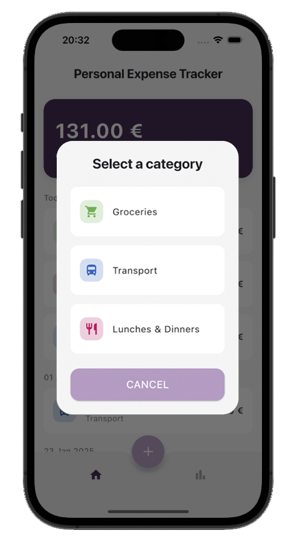

# Personal Expense Tracker App

## Overview
The Personal Expense Tracker App is a Flutter application designed to help users easily manage and track their expenses. Users can add new expenses, view them grouped by day, delete individual entries, and filter by categories (e.g., Food, Travel, Shopping). The app ensures that expense data is stored locally and remains available even after restarting the app. With a summary view showing total expenses for the month or year, the app also highlights the category with the highest spending.

Built using the BLoC pattern for state management, the app offers a clean separation of business logic from the UI, ensuring a scalable and maintainable codebase.

## Screenshots

  

 

## Features
* Add Expense Entries: Users can create new expense entries by providing the following details:
  * Amount: The cost of the expense.
  * Category: The type of expense (e.g., Food, Travel, Shopping).
  * Date: The date when the expense occurred.
  * Description: A short description of the expense.
* View Expenses: Displays a list of expenses grouped by day for better organization. Users can see a summary of each day's total expenses.
* Delete Expenses: Users can delete individual expense entries by swiping left on an expense item in the list or by clicking a delete button on each expense card. This action will remove the expense from the list and update the total expense calculation accordingly.
* Data Persistence: Expenses are stored locally on the device using a persistence mechanism (e.g., SQLite or shared preferences) so they remain visible even after restarting the app.
* Expense Summary: Provides a summary view showing:
  * Total expenses for the selected month or year.
  * The category with the highest spending for the selected time period.
* Category Filtering: Users can filter expenses by category (e.g., Food, Travel, Shopping) and see the corresponding expenses displayed.
* Responsive Design: Optimized for different screen sizes and orientations.

## Technologies Used
* **Flutter**: Framework for building high-quality, natively compiled applications for mobile, web, and desktop from a single codebase.
* **Dart**: Programming language used to write Flutter applications.
* **BLoC (Business Logic Component)**: State management pattern for separating business logic from UI components.
* **SQLite**: Used for local storage to persist expenses across app restarts.
* **Equatable**: Simplifies equality comparisons in Dart objects, making BLoC events and states more efficient.
* **Linting**: The project adheres to best coding practices using custom lint rules to maintain a clean codebase.
* **Widget Testing**: Comprehensive widget tests ensure the stability and reliability of UI components.

## Responsiveness
The application is designed to provide a consistent and enjoyable experience across various screen sizes, from small mobile devices to large tablets. Whether in portrait or landscape mode, the app adapts seamlessly to offer an intuitive and engaging user interface.

## Instructions to Run the App

### Prerequisites
Make sure you have Flutter installed on your machine. You can follow the installation steps from the official Flutter documentation: Flutter Installation.

### Getting Started
1. **Clone the repository:**

    ```bat
    git clone https://github.com/GianMen91/personal_expense_tracker.git
    ```

2. **Navigate to the project directory:**

    ```bat
    cd personal_expense_tracker
    ```

3. **Install the dependencies:**

    ```bat
    flutter pub get
    ```

4. **Run the app:**

    ```bat
    flutter run
    ```
    
This will launch the app in your preferred emulator or connected device.

